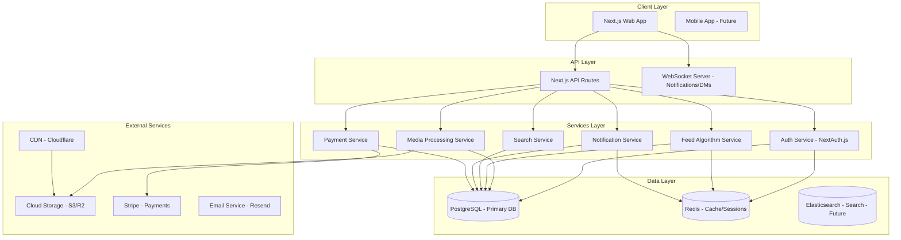
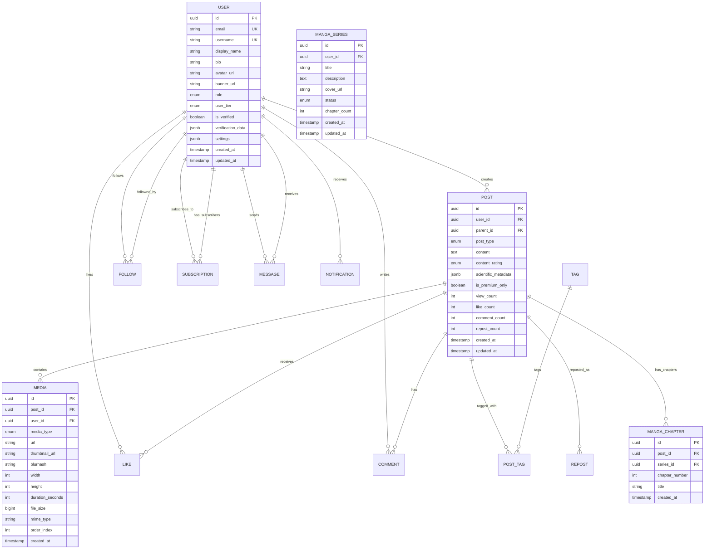
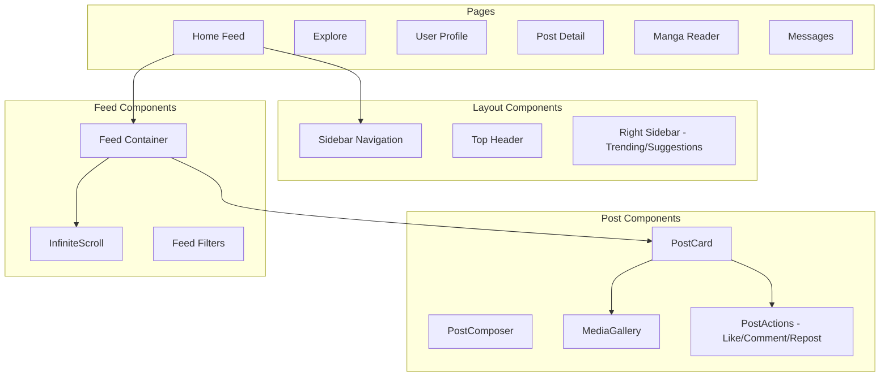
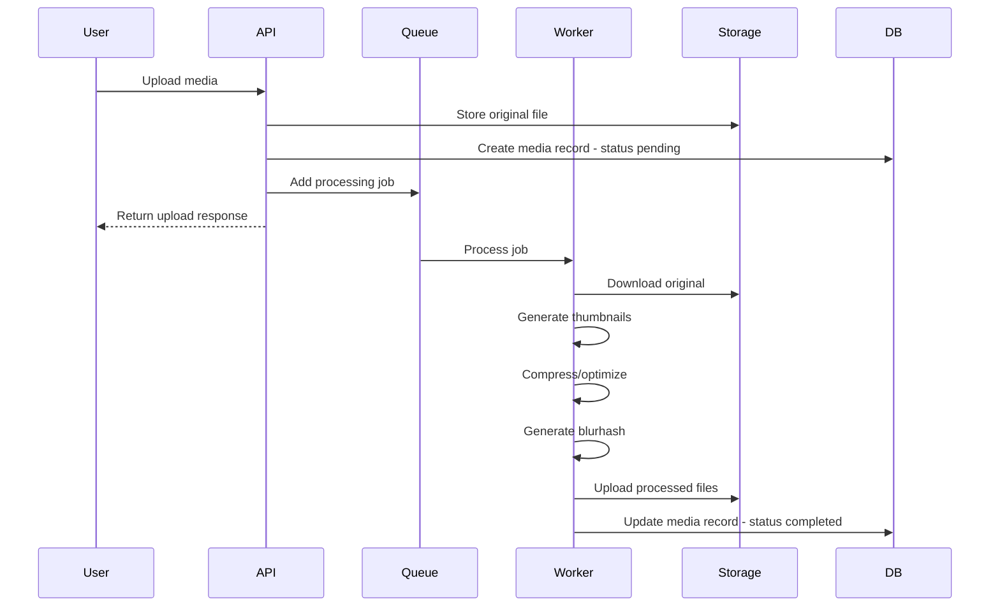

# SNS Platform Architecture Plan

## Project Overview

A social networking service combining features of Pixiv (art sharing) and X (microblogging) targeted at **Scientists**, **Mangaka** (manga artists), and **ROM** (Read-Only Mode) users.

### Key Requirements Summary

| Aspect | Decision |
|--------|----------|
| Content Types | Text, images, documents (PDF), manga series, videos |
| User Tiers | Verified Creators, Regular Creators, ROM users |
| Tech Stack | Next.js + PostgreSQL + Cloud Storage (S3/R2) |
| Social Features | Follow, likes, comments, reposts, DMs, notifications, feed algorithm |
| Monetization | Creator subscriptions, tips/donations, ads |
| Organization | Unified platform with tags, SFW/NSFW ratings, scientific metadata |

---

## System Architecture



---

## Database Schema Design

### Core Entities



### Complete Table Definitions

#### Users Table
```sql
CREATE TABLE users (
    id UUID PRIMARY KEY DEFAULT gen_random_uuid(),
    email VARCHAR(255) UNIQUE NOT NULL,
    username VARCHAR(50) UNIQUE NOT NULL,
    password_hash VARCHAR(255),
    display_name VARCHAR(100) NOT NULL,
    bio TEXT,
    avatar_url VARCHAR(500),
    banner_url VARCHAR(500),
    role VARCHAR(20) DEFAULT 'user' CHECK (role IN ('user', 'moderator', 'admin')),
    user_tier VARCHAR(20) DEFAULT 'rom' CHECK (user_tier IN ('rom', 'creator', 'verified_creator')),
    is_verified BOOLEAN DEFAULT FALSE,
    verification_data JSONB,
    creator_type VARCHAR(50)[], -- ['scientist', 'mangaka', 'artist', 'writer']
    settings JSONB DEFAULT '{}',
    follower_count INT DEFAULT 0,
    following_count INT DEFAULT 0,
    post_count INT DEFAULT 0,
    stripe_customer_id VARCHAR(255),
    stripe_account_id VARCHAR(255), -- For creator payouts
    created_at TIMESTAMPTZ DEFAULT NOW(),
    updated_at TIMESTAMPTZ DEFAULT NOW()
);

CREATE INDEX idx_users_username ON users(username);
CREATE INDEX idx_users_user_tier ON users(user_tier);
CREATE INDEX idx_users_creator_type ON users USING GIN(creator_type);
```

#### Posts Table
```sql
CREATE TABLE posts (
    id UUID PRIMARY KEY DEFAULT gen_random_uuid(),
    user_id UUID NOT NULL REFERENCES users(id) ON DELETE CASCADE,
    parent_id UUID REFERENCES posts(id) ON DELETE SET NULL, -- For replies/quote posts
    post_type VARCHAR(20) NOT NULL CHECK (post_type IN ('text', 'image', 'video', 'document', 'manga_chapter', 'series')),
    content TEXT,
    content_rating VARCHAR(10) DEFAULT 'sfw' CHECK (content_rating IN ('sfw', 'nsfw', 'nsfw_extreme')),
    
    -- Scientific metadata
    scientific_metadata JSONB, -- {doi, citations: [], institution, field, peer_reviewed}
    
    -- Manga metadata
    manga_series_id UUID REFERENCES manga_series(id),
    chapter_number INT,
    
    -- Access control
    is_premium_only BOOLEAN DEFAULT FALSE,
    visibility VARCHAR(20) DEFAULT 'public' CHECK (visibility IN ('public', 'followers', 'subscribers', 'private')),
    
    -- Counters (denormalized for performance)
    view_count INT DEFAULT 0,
    like_count INT DEFAULT 0,
    comment_count INT DEFAULT 0,
    repost_count INT DEFAULT 0,
    bookmark_count INT DEFAULT 0,
    
    -- Timestamps
    created_at TIMESTAMPTZ DEFAULT NOW(),
    updated_at TIMESTAMPTZ DEFAULT NOW(),
    deleted_at TIMESTAMPTZ
);

CREATE INDEX idx_posts_user_id ON posts(user_id);
CREATE INDEX idx_posts_created_at ON posts(created_at DESC);
CREATE INDEX idx_posts_post_type ON posts(post_type);
CREATE INDEX idx_posts_content_rating ON posts(content_rating);
CREATE INDEX idx_posts_manga_series ON posts(manga_series_id) WHERE manga_series_id IS NOT NULL;
CREATE INDEX idx_posts_feed ON posts(created_at DESC, user_id) WHERE deleted_at IS NULL;
```

#### Media Table
```sql
CREATE TABLE media (
    id UUID PRIMARY KEY DEFAULT gen_random_uuid(),
    post_id UUID REFERENCES posts(id) ON DELETE CASCADE,
    user_id UUID NOT NULL REFERENCES users(id),
    media_type VARCHAR(20) NOT NULL CHECK (media_type IN ('image', 'video', 'document', 'manga_page')),
    
    -- Storage info
    storage_key VARCHAR(500) NOT NULL, -- S3/R2 key
    url VARCHAR(500) NOT NULL,
    thumbnail_url VARCHAR(500),
    blurhash VARCHAR(100), -- For image placeholders
    
    -- Metadata
    width INT,
    height INT,
    duration_seconds INT, -- For videos
    file_size BIGINT NOT NULL,
    mime_type VARCHAR(100) NOT NULL,
    
    -- Ordering for galleries/manga pages
    order_index INT DEFAULT 0,
    
    -- Processing status
    processing_status VARCHAR(20) DEFAULT 'pending' CHECK (processing_status IN ('pending', 'processing', 'completed', 'failed')),
    
    created_at TIMESTAMPTZ DEFAULT NOW()
);

CREATE INDEX idx_media_post_id ON media(post_id);
CREATE INDEX idx_media_user_id ON media(user_id);
```

#### Social Tables
```sql
-- Follows
CREATE TABLE follows (
    follower_id UUID NOT NULL REFERENCES users(id) ON DELETE CASCADE,
    following_id UUID NOT NULL REFERENCES users(id) ON DELETE CASCADE,
    created_at TIMESTAMPTZ DEFAULT NOW(),
    PRIMARY KEY (follower_id, following_id)
);

CREATE INDEX idx_follows_following ON follows(following_id);

-- Likes
CREATE TABLE likes (
    user_id UUID NOT NULL REFERENCES users(id) ON DELETE CASCADE,
    post_id UUID NOT NULL REFERENCES posts(id) ON DELETE CASCADE,
    created_at TIMESTAMPTZ DEFAULT NOW(),
    PRIMARY KEY (user_id, post_id)
);

CREATE INDEX idx_likes_post_id ON likes(post_id);

-- Bookmarks
CREATE TABLE bookmarks (
    user_id UUID NOT NULL REFERENCES users(id) ON DELETE CASCADE,
    post_id UUID NOT NULL REFERENCES posts(id) ON DELETE CASCADE,
    created_at TIMESTAMPTZ DEFAULT NOW(),
    PRIMARY KEY (user_id, post_id)
);

-- Reposts
CREATE TABLE reposts (
    id UUID PRIMARY KEY DEFAULT gen_random_uuid(),
    user_id UUID NOT NULL REFERENCES users(id) ON DELETE CASCADE,
    original_post_id UUID NOT NULL REFERENCES posts(id) ON DELETE CASCADE,
    quote_content TEXT, -- For quote reposts
    created_at TIMESTAMPTZ DEFAULT NOW(),
    UNIQUE (user_id, original_post_id)
);

CREATE INDEX idx_reposts_original_post ON reposts(original_post_id);

-- Comments (using posts table with parent_id for threading)
-- Comments are just posts with a parent_id set
```

#### Tags Table
```sql
CREATE TABLE tags (
    id UUID PRIMARY KEY DEFAULT gen_random_uuid(),
    name VARCHAR(100) UNIQUE NOT NULL,
    slug VARCHAR(100) UNIQUE NOT NULL,
    category VARCHAR(50), -- 'science', 'manga', 'art', 'general'
    post_count INT DEFAULT 0,
    created_at TIMESTAMPTZ DEFAULT NOW()
);

CREATE TABLE post_tags (
    post_id UUID NOT NULL REFERENCES posts(id) ON DELETE CASCADE,
    tag_id UUID NOT NULL REFERENCES tags(id) ON DELETE CASCADE,
    PRIMARY KEY (post_id, tag_id)
);

CREATE INDEX idx_post_tags_tag_id ON post_tags(tag_id);
CREATE INDEX idx_tags_slug ON tags(slug);
```

#### Manga Series Table
```sql
CREATE TABLE manga_series (
    id UUID PRIMARY KEY DEFAULT gen_random_uuid(),
    user_id UUID NOT NULL REFERENCES users(id) ON DELETE CASCADE,
    title VARCHAR(255) NOT NULL,
    description TEXT,
    cover_url VARCHAR(500),
    status VARCHAR(20) DEFAULT 'ongoing' CHECK (status IN ('ongoing', 'completed', 'hiatus', 'cancelled')),
    genre VARCHAR(50)[],
    chapter_count INT DEFAULT 0,
    subscriber_count INT DEFAULT 0,
    is_premium BOOLEAN DEFAULT FALSE,
    created_at TIMESTAMPTZ DEFAULT NOW(),
    updated_at TIMESTAMPTZ DEFAULT NOW()
);

CREATE INDEX idx_manga_series_user ON manga_series(user_id);
```

#### Messaging Tables
```sql
CREATE TABLE conversations (
    id UUID PRIMARY KEY DEFAULT gen_random_uuid(),
    created_at TIMESTAMPTZ DEFAULT NOW(),
    updated_at TIMESTAMPTZ DEFAULT NOW()
);

CREATE TABLE conversation_participants (
    conversation_id UUID NOT NULL REFERENCES conversations(id) ON DELETE CASCADE,
    user_id UUID NOT NULL REFERENCES users(id) ON DELETE CASCADE,
    last_read_at TIMESTAMPTZ,
    PRIMARY KEY (conversation_id, user_id)
);

CREATE TABLE messages (
    id UUID PRIMARY KEY DEFAULT gen_random_uuid(),
    conversation_id UUID NOT NULL REFERENCES conversations(id) ON DELETE CASCADE,
    sender_id UUID NOT NULL REFERENCES users(id) ON DELETE CASCADE,
    content TEXT NOT NULL,
    media_url VARCHAR(500),
    is_read BOOLEAN DEFAULT FALSE,
    created_at TIMESTAMPTZ DEFAULT NOW()
);

CREATE INDEX idx_messages_conversation ON messages(conversation_id, created_at DESC);
```

#### Notifications Table
```sql
CREATE TABLE notifications (
    id UUID PRIMARY KEY DEFAULT gen_random_uuid(),
    user_id UUID NOT NULL REFERENCES users(id) ON DELETE CASCADE,
    type VARCHAR(50) NOT NULL, -- 'like', 'comment', 'follow', 'repost', 'mention', 'subscription', 'tip'
    actor_id UUID REFERENCES users(id) ON DELETE SET NULL,
    post_id UUID REFERENCES posts(id) ON DELETE CASCADE,
    data JSONB,
    is_read BOOLEAN DEFAULT FALSE,
    created_at TIMESTAMPTZ DEFAULT NOW()
);

CREATE INDEX idx_notifications_user ON notifications(user_id, created_at DESC);
CREATE INDEX idx_notifications_unread ON notifications(user_id) WHERE is_read = FALSE;
```

#### Monetization Tables
```sql
-- Creator subscription tiers
CREATE TABLE subscription_tiers (
    id UUID PRIMARY KEY DEFAULT gen_random_uuid(),
    creator_id UUID NOT NULL REFERENCES users(id) ON DELETE CASCADE,
    name VARCHAR(100) NOT NULL,
    description TEXT,
    price_cents INT NOT NULL,
    currency VARCHAR(3) DEFAULT 'USD',
    benefits TEXT[],
    is_active BOOLEAN DEFAULT TRUE,
    stripe_price_id VARCHAR(255),
    created_at TIMESTAMPTZ DEFAULT NOW()
);

-- User subscriptions to creators
CREATE TABLE subscriptions (
    id UUID PRIMARY KEY DEFAULT gen_random_uuid(),
    subscriber_id UUID NOT NULL REFERENCES users(id) ON DELETE CASCADE,
    creator_id UUID NOT NULL REFERENCES users(id) ON DELETE CASCADE,
    tier_id UUID NOT NULL REFERENCES subscription_tiers(id),
    status VARCHAR(20) DEFAULT 'active' CHECK (status IN ('active', 'cancelled', 'past_due', 'expired')),
    stripe_subscription_id VARCHAR(255),
    current_period_start TIMESTAMPTZ,
    current_period_end TIMESTAMPTZ,
    created_at TIMESTAMPTZ DEFAULT NOW(),
    cancelled_at TIMESTAMPTZ,
    UNIQUE (subscriber_id, creator_id)
);

CREATE INDEX idx_subscriptions_creator ON subscriptions(creator_id);

-- Tips/Donations
CREATE TABLE tips (
    id UUID PRIMARY KEY DEFAULT gen_random_uuid(),
    sender_id UUID NOT NULL REFERENCES users(id),
    recipient_id UUID NOT NULL REFERENCES users(id),
    post_id UUID REFERENCES posts(id),
    amount_cents INT NOT NULL,
    currency VARCHAR(3) DEFAULT 'USD',
    message TEXT,
    stripe_payment_intent_id VARCHAR(255),
    status VARCHAR(20) DEFAULT 'completed',
    created_at TIMESTAMPTZ DEFAULT NOW()
);

CREATE INDEX idx_tips_recipient ON tips(recipient_id);
```

---

## API Structure

### API Routes Organization

```
/api
├── /auth
│   ├── [...nextauth].ts    # NextAuth.js handlers
│   ├── register.ts         # User registration
│   └── verify.ts           # Email/creator verification
│
├── /users
│   ├── [username]
│   │   ├── index.ts        # GET user profile
│   │   ├── posts.ts        # GET user posts
│   │   ├── media.ts        # GET user media gallery
│   │   ├── series.ts       # GET user manga series
│   │   └── followers.ts    # GET followers/following
│   ├── me.ts               # GET/PATCH current user
│   └── settings.ts         # PATCH user settings
│
├── /posts
│   ├── index.ts            # GET feed, POST create
│   ├── [id]
│   │   ├── index.ts        # GET/PATCH/DELETE post
│   │   ├── like.ts         # POST/DELETE like
│   │   ├── bookmark.ts     # POST/DELETE bookmark
│   │   ├── repost.ts       # POST repost
│   │   └── comments.ts     # GET/POST comments
│   └── upload.ts           # POST media upload
│
├── /feed
│   ├── home.ts             # GET personalized feed
│   ├── explore.ts          # GET explore/trending
│   └── following.ts        # GET following-only feed
│
├── /manga
│   ├── series
│   │   ├── index.ts        # GET all, POST create
│   │   └── [id].ts         # GET/PATCH/DELETE series
│   └── chapters
│       └── [id].ts         # GET chapter with pages
│
├── /search
│   ├── posts.ts            # Search posts
│   ├── users.ts            # Search users
│   └── tags.ts             # Search/suggest tags
│
├── /messages
│   ├── conversations.ts    # GET conversations
│   └── [conversationId].ts # GET/POST messages
│
├── /notifications
│   ├── index.ts            # GET notifications
│   └── read.ts             # POST mark as read
│
├── /subscriptions
│   ├── tiers.ts            # Creator tier management
│   ├── subscribe.ts        # POST subscribe to creator
│   └── manage.ts           # GET/PATCH subscriptions
│
├── /payments
│   ├── tip.ts              # POST send tip
│   ├── webhook.ts          # Stripe webhooks
│   └── payout.ts           # Creator payouts
│
└── /admin
    ├── users.ts            # User management
    ├── verification.ts     # Creator verification
    └── moderation.ts       # Content moderation
```

### Key API Endpoints

#### Authentication
```typescript
// POST /api/auth/register
interface RegisterRequest {
  email: string;
  username: string;
  password: string;
  displayName: string;
  userTier: 'rom' | 'creator';
  creatorTypes?: ('scientist' | 'mangaka' | 'artist' | 'writer')[];
}

// POST /api/auth/verify (for creator verification)
interface VerifyCreatorRequest {
  verificationType: 'scientist' | 'mangaka' | 'artist';
  documents: string[]; // URLs to uploaded verification docs
  institution?: string;
  portfolio?: string;
}
```

#### Posts
```typescript
// POST /api/posts
interface CreatePostRequest {
  postType: 'text' | 'image' | 'video' | 'document' | 'manga_chapter';
  content?: string;
  mediaIds?: string[];
  contentRating: 'sfw' | 'nsfw' | 'nsfw_extreme';
  tags?: string[];
  visibility: 'public' | 'followers' | 'subscribers' | 'private';
  isPremiumOnly?: boolean;
  scientificMetadata?: {
    doi?: string;
    citations?: string[];
    institution?: string;
    field?: string;
  };
  mangaSeriesId?: string;
  chapterNumber?: number;
}

// GET /api/feed/home
interface FeedResponse {
  posts: Post[];
  nextCursor?: string;
}
```

---

## Frontend Architecture

### Directory Structure

```
src/
├── app/                          # Next.js App Router
│   ├── (auth)/
│   │   ├── login/
│   │   ├── register/
│   │   └── verify/
│   ├── (main)/
│   │   ├── layout.tsx           # Main layout with sidebar
│   │   ├── page.tsx             # Home feed
│   │   ├── explore/
│   │   ├── notifications/
│   │   ├── messages/
│   │   ├── bookmarks/
│   │   └── settings/
│   ├── [username]/
│   │   ├── page.tsx             # User profile
│   │   ├── posts/
│   │   ├── media/
│   │   ├── series/
│   │   └── subscribers/
│   ├── post/[id]/
│   ├── manga/
│   │   ├── [seriesId]/
│   │   └── read/[chapterId]/
│   └── api/                      # API routes
│
├── components/
│   ├── ui/                       # Base UI components (shadcn/ui)
│   ├── layout/
│   │   ├── Sidebar.tsx
│   │   ├── Header.tsx
│   │   ├── MobileNav.tsx
│   │   └── RightSidebar.tsx
│   ├── post/
│   │   ├── PostCard.tsx
│   │   ├── PostComposer.tsx
│   │   ├── PostActions.tsx
│   │   ├── MediaGallery.tsx
│   │   └── PostThread.tsx
│   ├── user/
│   │   ├── UserAvatar.tsx
│   │   ├── UserCard.tsx
│   │   ├── ProfileHeader.tsx
│   │   └── FollowButton.tsx
│   ├── manga/
│   │   ├── MangaReader.tsx
│   │   ├── ChapterList.tsx
│   │   └── SeriesCard.tsx
│   ├── feed/
│   │   ├── Feed.tsx
│   │   ├── FeedFilter.tsx
│   │   └── InfiniteScroll.tsx
│   └── modals/
│       ├── ComposeModal.tsx
│       ├── ImageViewer.tsx
│       └── SubscribeModal.tsx
│
├── hooks/
│   ├── useAuth.ts
│   ├── usePosts.ts
│   ├── useInfiniteScroll.ts
│   └── useWebSocket.ts
│
├── lib/
│   ├── api.ts                   # API client
│   ├── auth.ts                  # Auth utilities
│   ├── db.ts                    # Database client (Prisma)
│   ├── storage.ts               # S3/R2 utilities
│   └── stripe.ts                # Stripe utilities
│
├── stores/                      # Zustand stores
│   ├── authStore.ts
│   ├── feedStore.ts
│   └── notificationStore.ts
│
└── types/
    ├── user.ts
    ├── post.ts
    └── api.ts
```

### Key Components



---

## Third-Party Services

| Service | Purpose | Alternative |
|---------|---------|-------------|
| **Vercel** | Hosting & Deployment | AWS, Railway |
| **PostgreSQL (Neon/Supabase)** | Primary Database | PlanetScale, Railway Postgres |
| **Cloudflare R2** | Media Storage | AWS S3, Backblaze B2 |
| **Redis (Upstash)** | Caching & Sessions | Redis Cloud |
| **Stripe** | Payments | Paddle, LemonSqueezy |
| **Resend** | Transactional Email | SendGrid, Postmark |
| **Cloudflare** | CDN & DDoS Protection | Fastly, AWS CloudFront |
| **NextAuth.js** | Authentication | Clerk, Auth0 |
| **Prisma** | ORM | Drizzle, Kysely |

### Media Processing Pipeline



---

## Implementation Phases

### Phase 1: Foundation
**Goal**: Basic platform with core posting functionality

- [ ] Project setup with Next.js 14, TypeScript, Tailwind CSS
- [ ] Database setup with PostgreSQL and Prisma
- [ ] Authentication system (NextAuth.js)
- [ ] User registration with tier selection (ROM/Creator)
- [ ] Basic user profiles
- [ ] Text posting functionality
- [ ] Image upload and display
- [ ] Basic feed (chronological)
- [ ] Follow/unfollow system
- [ ] Like functionality

### Phase 2: Social Features
**Goal**: Full social interaction capabilities

- [ ] Comments and replies (threaded)
- [ ] Repost and quote post
- [ ] Bookmarks
- [ ] Notifications system (in-app)
- [ ] Tag system
- [ ] User search
- [ ] Post search
- [ ] Content rating system (SFW/NSFW)
- [ ] Settings page
- [ ] Profile customization

### Phase 3: Advanced Content
**Goal**: Support for specialized content types

- [ ] Video upload and streaming
- [ ] Document upload (PDF)
- [ ] Manga series system
- [ ] Manga reader component
- [ ] Scientific metadata for posts
- [ ] DOI integration
- [ ] Media galleries
- [ ] Content organization (collections)

### Phase 4: Messaging & Real-time
**Goal**: Real-time communication features

- [ ] Direct messaging system
- [ ] WebSocket integration
- [ ] Real-time notifications
- [ ] Online presence indicators
- [ ] Push notifications (PWA)

### Phase 5: Monetization
**Goal**: Creator monetization features

- [ ] Stripe integration
- [ ] Subscription tiers for creators
- [ ] Premium-only content
- [ ] Tipping system
- [ ] Creator dashboard
- [ ] Payout system
- [ ] Subscription management

### Phase 6: Discovery & Algorithm
**Goal**: Content discovery and personalization

- [ ] Algorithmic feed
- [ ] Trending posts/tags
- [ ] User recommendations
- [ ] Explore page
- [ ] Category browsing
- [ ] Advanced search filters

### Phase 7: Creator Verification & Moderation
**Goal**: Trust and safety features

- [ ] Creator verification system
- [ ] Verification badge display
- [ ] Content moderation tools
- [ ] Report system
- [ ] Admin dashboard
- [ ] Content filtering

### Phase 8: Polish & Scale
**Goal**: Production readiness

- [ ] Performance optimization
- [ ] CDN integration
- [ ] Rate limiting
- [ ] Error tracking (Sentry)
- [ ] Analytics
- [ ] SEO optimization
- [ ] Accessibility audit
- [ ] Mobile responsiveness polish
- [ ] Documentation

---

## Risk Assessment

| Risk | Impact | Mitigation |
|------|--------|------------|
| **Media storage costs** | High | Implement file size limits, use efficient compression, consider user-based quotas |
| **Video processing complexity** | Medium | Use managed services (Mux, Cloudflare Stream) or defer video to later phase |
| **Feed algorithm complexity** | Medium | Start with chronological, iterate based on user feedback |
| **Payment fraud** | High | Use Stripe's built-in fraud detection, implement additional verification |
| **Content moderation at scale** | High | Implement automated filtering, community reporting, gradual rollout |
| **NSFW content legal issues** | High | Clear ToS, age verification, geoblocking where required |
| **Database performance** | Medium | Proper indexing, connection pooling, consider read replicas |

---

## Technology Decisions Summary

| Decision | Choice | Rationale |
|----------|--------|-----------|
| Framework | Next.js 14 (App Router) | Full-stack, great DX, Vercel integration |
| Database | PostgreSQL | JSONB support, robust, scalable |
| ORM | Prisma | Type-safe, great migrations |
| Auth | NextAuth.js | Flexible, supports multiple providers |
| Styling | Tailwind CSS + shadcn/ui | Rapid development, consistent design |
| State | Zustand + React Query | Simple, performant, great caching |
| Storage | Cloudflare R2 | S3-compatible, no egress fees |
| Payments | Stripe | Industry standard, Connect for marketplaces |
| Real-time | Socket.io or Pusher | Reliable WebSocket implementation |

---

## Next Steps

1. **Review this plan** and provide feedback on any changes
2. **Prioritize features** if you want to adjust the phase order
3. **Switch to Code mode** to begin Phase 1 implementation
4. Start with project scaffolding and database setup

Would you like to proceed with implementation or discuss any aspects of this plan further?
